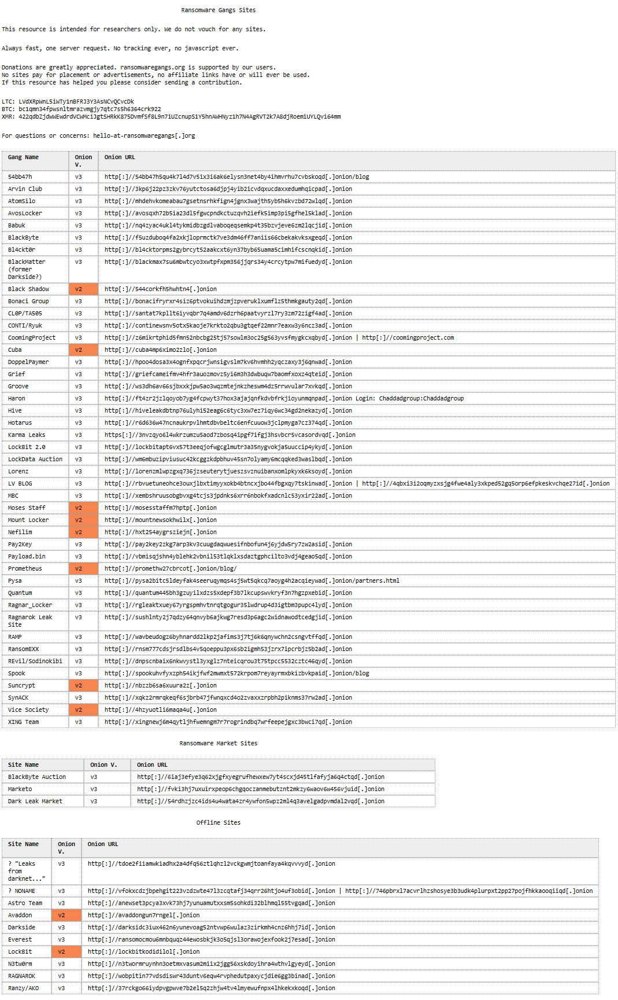
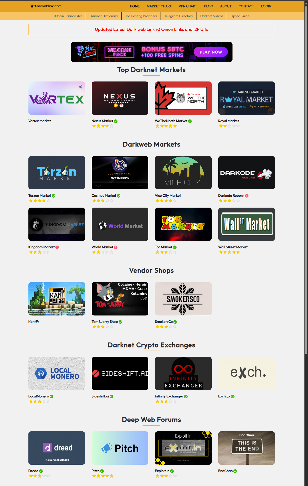
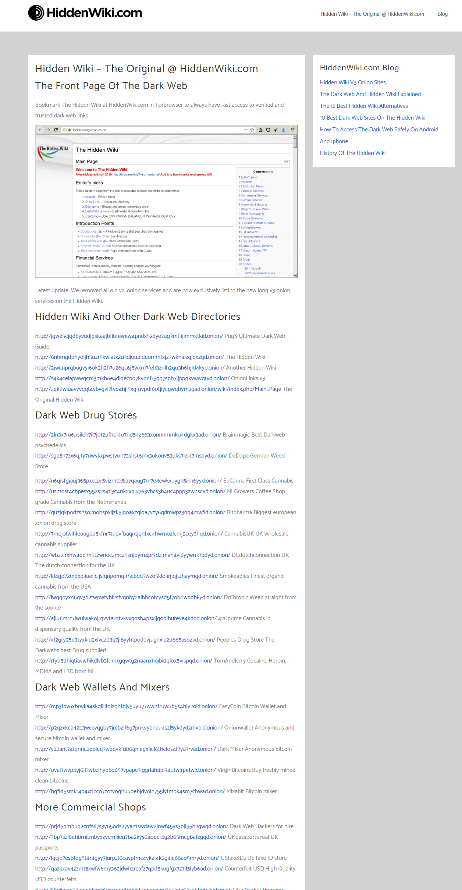

- [Intro](#intro)
- [What is the TOR network](#what-is-the-tor-network)
- [Tails OS](#tails-os)
  - [Install of Tails OS](#install-of-tails-os)
- [Disclaimer:](#disclaimer)
- [Exploring the Dark web.](#exploring-the-dark-web)
- [Reference Links](#reference-links)

# Intro

Welcome to the Dark web class, We will go over what is the dark web.

# What is the TOR network

The Tor network, short for The Onion Router, is a decentralized network that
enables users to browse the internet anonymously. It achieves this by routing
internet traffic through a series of encrypted relays, obscuring the user's IP
address and location. Here's how it works:

There are three node you have to know about the tor network. 
- Entry Node (Guard Node): This is the first node that your data passes through
  when you connect to the Tor network. It is responsible for encrypting your
  traffic before it passes it along to the next node. The entry node only knows
  your IP address, not the final destination of your data.

- Middle Node: After passing through the entry node, your data is sent to a
  middle node. Middle nodes act as relays, passing the encrypted data along
  the Tor network without knowing the source or destination of the traffic.

- Exit Node: The exit node is the final node that your data passes through
  before reaching its destination on the internet. The exit node decrypts your
  data and sends it to its final destination. It is the only node that can see
  the unencrypted data and the destination of your traffic.

# Tails OS

Tails, short for The Amnesic Incognito Live System, is a security-focused
operating system designed to preserve privacy and anonymity. It is often used
as a live operating system, meaning it can be booted from a USB drive or DVD
without needing to install it on the computer's hard drive. 

## Install of Tails OS

The First thing to do, to install Tails Os is to get the image file from Tails
site: https://tails.net/install/index.en.html

Once you get the image file then you can use *BalenaEtcher* tool to install it
on an USB drive. Now you can us tails on its on from a USB drive or install it 
on an computer.

> Note: You can run Tails on a VM but its not recommended 

# Disclaimer:

The information provided herein is for educational and informational purposes
only.

We do not endorse or condone any illegal or unethical activities, including but
not limited to accessing or engaging in activities on the dark web. Any actions
taken based on the information provided are at the sole discretion and
responsibility of the user.

Furthermore, while efforts have been made to ensure the accuracy and
reliability of the information presented, we make no representations or
warranties of any kind, express or implied, about the content's completeness,
accuracy, reliability, suitability, or availability.

We will not be liable for any loss or damage from using this information. By
accessing and using this information, you agree to waive any claims against us,
our affiliates, agents, employees, and contributors arising from such use.

Always exercise caution, discretion, and diligence when navigating the internet,
especially when accessing sensitive or restricted content.

# Exploring the Dark web.

The following are clear net(Website that don't need the tor network to access)
sites that contain address to live dark web sites. This site are used for
people that are just getting into the dark web.

**Please Be careful.**

- Ransomware Gang Research: http://ransomwaregangs.org/ 
  

- Dark web link: https://darkweblink.com/ This site is like 
  

- hidden wiki link: https://hiddenwiki.com/
  

# Reference Links
- Tails OS: https://tails.net/
- Ransomware Gang Research: http://ransomwaregangs.org/
- Dark Web Research: https://darkweblink.com/
- Hidden Wiki: https://hiddenwiki.com/
