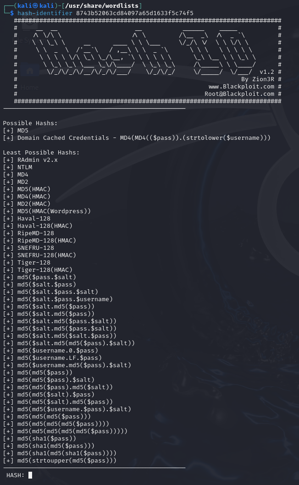

# Intro
Welcome to the `Hashcat` classes, in this class you will learn how to use `Hashcat` to brute force password or using wordlist to do a wordlist attack. 

- [Intro](#intro)

# Overview of Hashcat
Hashcat tool is a advanced password "recovery tool", if you know John the ripper tool then you should an idea about types of password cracking. The main difference between `hashcat` and John the ripper is that `Hashcat` can use the GPU of a computer. And if you know anything about bitcoin mining, you know that GPU is a lot better at that type of work load. 

>Note: If you are using `hashcat` in a VM (virtual machine) you will have to bridge your GPU to the vm. Because in an VM `hashcat` will just use the CPU assigned to the VM.

The first thing to know about password cracking is how do we even get the hash to crack. A hash refers to a cryptographic representation of a password or other data, generated using a hash function. Hash functions are mathematical algorithms that take an input (such as a password) and produce a fixed-size string of characters.

Hash can look like any one of this, 
```
MD5 - 8743b52063cd84097a65d1633f5c74f5
NetNTLMv2 - admin::N46iSNekpT:08ca45b7d7ea58ee:88dcbe4446168966a153a0064958dac6:5c7830315c7830310000000000000b45c67103d07d7b95acd12ffa11230e0000000052920b85f78d013c31cdb3b92f5d765c783030
SHA2-256 - 	127e6fbfe24a750e72930c220a8e138275656b8e5d8f48a98c3c92df2caba935
```
There is a lot more examples on the main [Hashcat site](https://hashcat.net/wiki/doku.php?id=example_hashes)

# Identify Hash
In the real world, if you don't know what type of hash something is you have to make a guess on what hash it could be. Unless you know what type of hash it is before hand, like in most windows computer would use the NetNTLMv2 or NetNTLMv1. So what can you do if you have a hash and don't know what type of hash it could be, then you have to use online or offline tool to make a guess on what type of hash it is. We will be showing off the `hash-identifier` tool that is install on most kali machines. 

You can use `hash-identifier` in two ways.
- Option 1
  ```bash
    hash-identifier <hash>
    ```
- Option 2 
  ``` bash
  hash-identifier
  ```
  Then insert the hash

You will get results like this:



You can see that the most possible hash is MD5 or domain cached credentials - MD4. So now we know that it is some type of MD4 or MD5 hash. There are many way to crack this but we are going to so three ways.
- Brute force
- Word List
- Mask Brute force

# Brute Force

# Word List
# Mask Brute Force

https://hashcat.net/hashcat/
https://hashcat.net/wiki/doku.php?id=hashcat


2d6575670448073a872438b52232ec330fadbe507fa4d3b4bf130c87c71cd2fb

6ad941a2fef0e8f6b748aaadb2ef42a9


812B6CF569DCFAAC52E99C4FA80904F5


# References

- **Example Hashes:** https://hashcat.net/wiki/doku.php?id=example_hashes