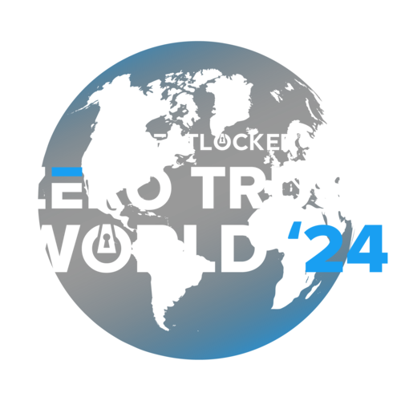

# Hacking Labs Content

This repository holds all the course content from hacking labs from ZTW2024.
The purpose of this was to share content with those that wish to follow along
interactively with the Hacking Lab's, get a recap, or extend their knowledge further.

## Courses

* **Intro to Rubbery Ducky:** [ZTW24/Rubber-Ducky-Intro (Course Content)](Rubber-Ducky-Intro/README.md)
* **Advanced Rubber Ducky:** [ZTW24/Rubber-Ducky-Advanced (Course Content)](Rubber-Ducky-Advanced/README.md)
* **Flipper Zero Unleashed:** [ZTW24/Flipper-Zero-Unleashed (Course Content)](Flipper-Zero-Unleashed/README.md)
* **Metasploit-CTF:**  [ZTW24/Metasploit-CTF (Course Content)](Metasploit-CTF/README.md)
*  **Incident-Response:** [ZTW24/Incident-Response (Course Content)](Incident-Response/README.md)
>  **Tip:** Click one of links above to access its respective course content.

## Values

Our Team at ThreatLocker makes it an absolute goal to educate and advocate for
a cyber-safe world. We have dedicated countless hours to crafting our content
to ensure a comprehensive and enriching learning experience. We hope you have an
amazing learning experience at ZTW2024!
