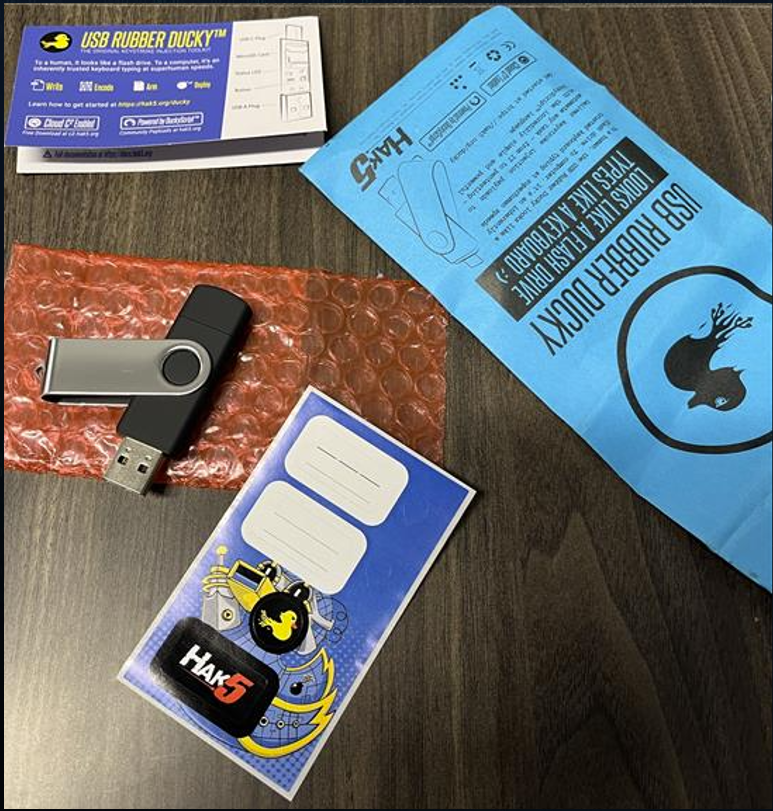
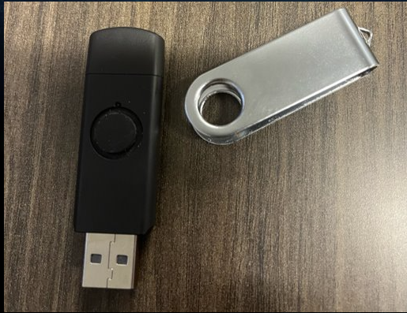
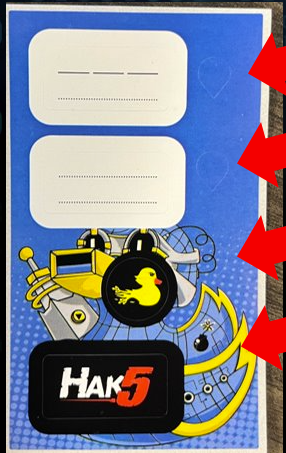
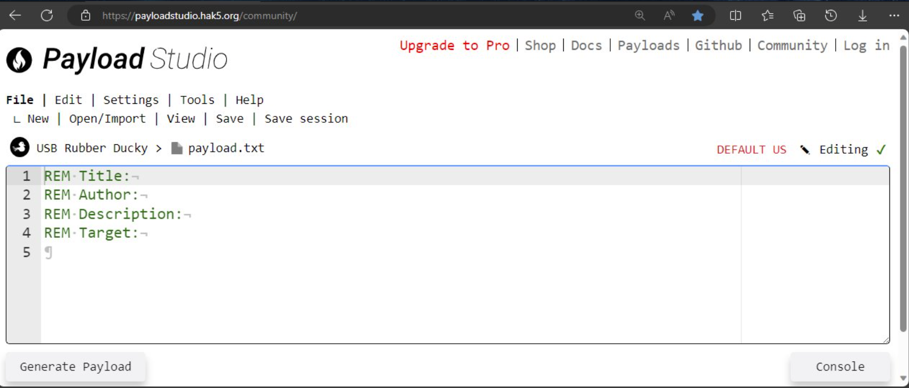
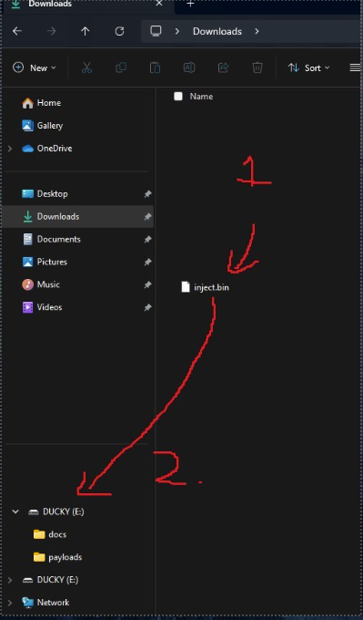

# Rubber Ducky Intro


## Objectives 

1. Setting up the rubber ducky
2. Know how to use the web base IDE
3. Generate payload 
4. Launching the payload

## Unboxing



You will get the following in the Rubber ducky Bag:

- info card
- USB Rubber Ducky in an Esp bag
- Sticker card

# Button Mod For The Ducky

The reason why we open the ducky is to add some sticker to the case, so it is
easy to press the button when the case is put back together.

1. Take the metal cover off by lightly prying it open to release the ducky.

   

2. Take a knife or fingernail to light pry open the case. (I use the small gap
   on the USB A side to pry it open)

   

3. Once open, on the sticker card you will have four small tear shape stickers.
   (NOTE: If you add 4 sticker it will make the button very easy to press and
   only having 1 sticker will make it hard to press the button.)

   

4. Place the tear drop sticker on this spot of the case

   

5. Put the Rubber ducky back together.


# Payload Studio IDE(Integrated development environment)
Site: https://payloadstudio.hak5.org/community/

This will be the place that you will spend most of your time when making payloads for the ducky.



The menu will be as follows:

- File (This where you can make new files and save them.)
  -	New
  - Open/Import
  - View
  - Save
  - Save session
- Edit (This is where you can make changes inside the payload.)
	- Undo
	- Redo
	- Fold all
	- Unfold all
	- find
	- Replace
	- copy payload
	- Cursor
	- BOF
	- EOF
	- Last change
- Settings (This is where you can make it dark mode and other changes)
	- IDE settings
	- editor settings
	- Compiler settings
- Tools
	- reset app data
	- Restore Default settings
- Help
	- Payload Studio documentation
	- device documentation
	- Show key binds
	- Product tour
- USB Rubber ducky (This is where you can what you are writing for. like you
  want to write code for the Hak5 Bash bunny or an O.M.G cable)
- Payload.txt (This where you can change the name of the payload when you save
  it as a .txt file)
- Generate payload (Generate payload into an inject.bin file.)

# Hello World

What's a better way to learn than a Hello world.
I have add a bunch of Comments to explain how this thing works

```duckyscript
REM Title: Hello world
REM Author: Threatlocker_Ray
REM Description: Prints hello world.
REM Target: Windows

REM This is a comment.

DELAY 3000
REM ^^^ This is a delay so that the ducky doesn't start the attack early when you plug it in. This Delay waits 3 seconds.

GUI r
REM ^^^ Opens the run prompt.

DELAY 1000
REM ^^^ Delays are done in milliseconds so this would wait 1 second.

STRINGLN Notepad.exe
REM ^^^ This will write NotePad.exe and hit the enter key into the run prompt.

DELAY 1000
REM ^^^ Delay to wait for notepad to open.

STRING Hello, World!
REM ^^^ Write Hello, World! to notepad without hitting enter
```

# Generate Payload and getting it on the ducky.

   

1. Hit the Generate payload button
2. Hit the Download button (This should save it to the download folder)
3. Plug in the Rubber ducky. (If you already have a payload on it, you can
   press the button to stop the payload Early unless you have the button
   assigned to do something)
4. Move the inject.bin file to the root of ducky.

   

5. eject ducky

# Running payload

Now all you have to do is just to plug in the ducky and the ducky should start
sending keystrokes.


# Notes
- You will most likely have to play with the delay if it does run right.
- You should add the title, Author, Description, and the target incase you
  forgot or someone else have to look at it.


# Great Site to help you learn more.

* Ducky Quick Reference Guild: https://docs.hak5.org/hak5-usb-rubber-ducky/duckyscript-tm-quick-reference
* Payload Library: https://github.com/hak5/usbrubberducky-payloads
